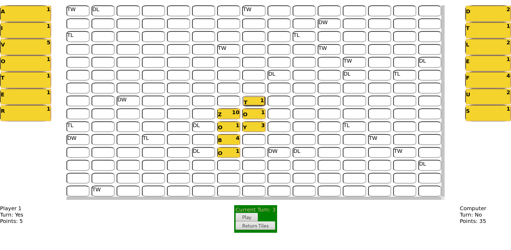

This is a words-with-friends clone

Demo: https://davidm.me/projects/words-with-friends/

It has two modes: Player V Player, and Player V Computer

To run:
* `git clone https://github.com/DovidM/words-with-friends`
* `cd words-with-friends/`
* `npm start`
